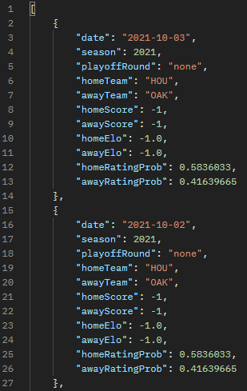

# Class Exam Instruction: Building a ZIO Application Backend


## Major League API Documentation

This is the API documentation for the Major League API project. The API provides several endpoints for retrieving game data and statistics using ELO stats for scoring and MLB stats for prediction.  
All Teams names are represented by 3 letters code.  
The API can be accessed at `http://localhost:8080`.

## Running the Project

To run the project, use the following commands:

```bash
sbt
project rest2
compile
reStart
```

After running these commands, the API will be accessible at `http://localhost:8080`.

## Endpoints

### GET /init

Imports game data from a CSV file.  
It's already done automatically when you run the project firt.  
Can be useful if you decide to modify some data.  

**Example:** `http://localhost:8080/init`

---

### GET /games/latest/{homeTeam}/{awayTeam}

Returns the most recent game played between the specified home and away teams.  

**Example:** `http://localhost:8080/games/latest/SEA/ANA`  


---

### GET /games/predict/{homeTeam}/{awayTeam}

Returns a prediction for the next game between the specified home and away teams.
It's done using "rating_prob1" in the CSV file (for the home team) on the most recent match listed.

**Example:** `http://localhost:8080/games/predict/STL/CHC`  


---

### GET /games/count

Returns the total number of games in the database.

**Example:** `http://localhost:8080/games/count`  


---

### GET /games/history/{homeTeam}

Returns the game history for the specified home team.

**Example:** `http://localhost:8080/games/history/HOU`  


---

### GET /games/highscore

Returns the game with the highest home team ELO score.

**Example:** `http://localhost:8080/games/highscore`  


---

### GET /games/lowscore

Returns the game with the lowest home team ELO score.

**Example:** `http://localhost:8080/games/lowscore`  


---

# Team Members
Vincent MARGUET, Logan LE LAY, Michaël NASS, Loïc TRÉHIN (M1-SE2)
